# Project Title: DocQA System

## Overview
The DocQA System is an AI-powered question-answering application designed to assist users in retrieving information from a specific company's or project's documentation. It leverages advanced language models to generate accurate and concise answers based on the provided context and keywords.

## Features
- **Web Crawling**: Automatically crawls documentation from specified URLs to gather relevant content.
- **Keyword Generation**: Generates keywords from user questions to enhance search relevance.
- **Contextual Answering**: Provides detailed answers based on the context retrieved from the documentation.
- **User-Friendly Interface**: Simple and intuitive web interface for users to interact with the system.

## Data Handling
The system utilizes a SQLite database to store crawled documentation. The `DataHandler` class manages the database operations, including creating tables, storing embeddings, and retrieving documents. Data is chunked into manageable pieces, and embeddings are generated using the SentenceTransformer model. This allows for efficient storage and retrieval of relevant information.

## Hybrid Search and Reranking
The retrieval process employs a hybrid search strategy that combines two techniques: BM25 and FAISS. 

1. **BM25**: This is a probabilistic model that ranks documents based on the term frequency and inverse document frequency. It is effective for keyword-based searches and provides an initial ranking of documents.

2. **FAISS**: This is a library for efficient similarity search and clustering of dense vectors. After encoding the documents into embeddings, FAISS is used to quickly retrieve the most similar documents based on the user's query.

After the initial retrieval, the results are reranked using a cross-encoder model. This model evaluates the relevance of the documents in the context of the user's question, ensuring that the most pertinent information is presented.

## Getting Started

### Prerequisites
- Python 3.7 or higher
- Flask
- Required Python packages (listed in `requirements.txt`)

### Installation
1. Clone the repository:
   ```bash
   git clone https://github.com/yourusername/docqa-system.git
   cd docqa-system
   ```

2. Install the required packages:
   ```bash
   pip install -r requirements.txt
   ```

3. Set up environment variables:
   Create a `.env` file in the root directory and add your `GROQ_API_KEY`:
   ```
   GROQ_API_KEY=your_api_key_here
   ```

### Running the Application
1. Start the Flask server:
   ```bash
   python main.py
   ```

2. Open your web browser and navigate to `http://127.0.0.1:5000`.

### Usage
- **Crawl Documentation**: Use the `/crawl` endpoint to start crawling documentation from a specified URL.
- **Process Data**: After crawling, use the `/process` endpoint to process and store the crawled data.
- **Ask Questions**: Use the `/ask` endpoint to submit questions and receive answers based on the crawled documentation.
- **Clear Database**: Use the `/clear` endpoint to reset the database and remove all stored data.

## Visual Overview

```mermaid
graph TD
    A[("🌐 Start")] --> B["📋 User Interface"]
    B -->|"URL + Depth"| C["🕷️ Web Crawler"]
    C -->|"Raw Data"| D["🔧 Data Handler"]
    D -->|"Processed Data"| E[("💾 Database")]
    B -->|"User Query"| F["🧠 LLMAssistant"]
    F -->|"Keywords+Query"| G["🔍 Retriever"]
    G -->|"Hybrid Search"| E
    G -->|"Top Results as Context"| F
    F -->|"Generated Answer"| B
    B -->|"Clear DB"| H["🗑️ Data Cleaner"]
    H --> E

    style A fill:#ffd54f,stroke:#333,stroke-width:2px
    style B fill:#81c784,stroke:#333,stroke-width:2px
    style C fill:#ff8a80,stroke:#333,stroke-width:2px
    style D fill:#64b5f6,stroke:#333,stroke-width:2px
    style E fill:#ba68c8,stroke:#333,stroke-width:2px
    style F fill:#ffb74d,stroke:#333,stroke-width:2px
    style G fill:#aed581,stroke:#333,stroke-width:2px
    style H fill:#e57373,stroke:#333,stroke-width:2px

    classDef default font-weight:bold,font-size:12px,fill:#ffffff,color:#333;
```



## Conclusion
The DocQA System integrates advanced AI techniques to provide a robust solution for retrieving and answering questions based on documentation. By combining web crawling, hybrid search, and contextual answering, it offers users a powerful tool for information retrieval.
